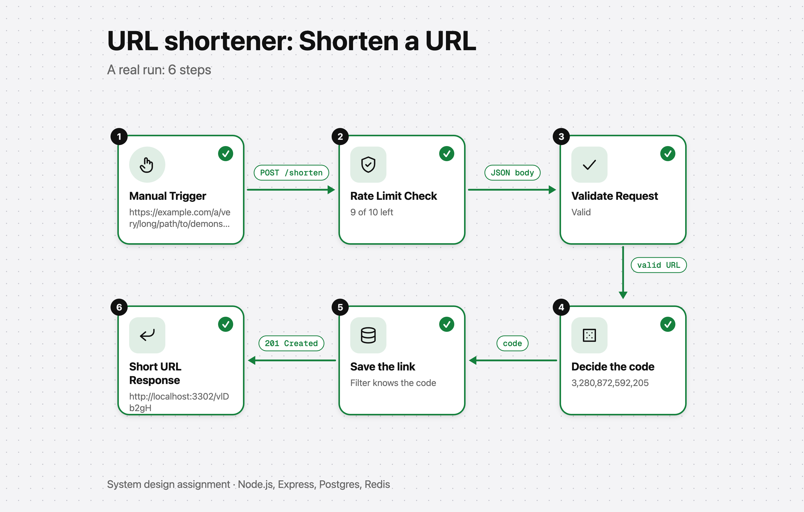
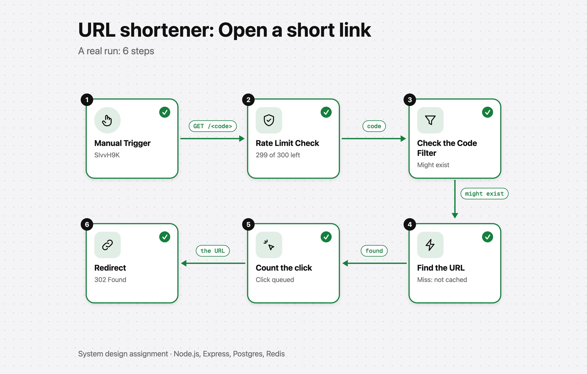

# URL shortener

A URL shortener built to be fast and safe under load: Postgres keeps the links, Redis caches them and counts clicks, and a small web page shows what happens to a request, step by step.

Part of a system design assignment. Node.js, Express, Postgres, Redis, and a Next.js page.



## Run it

You need Node.js 24 and Docker.

```
docker compose up -d            # Postgres on 5440, Redis on 6380
cp .env.example .env            # the settings, with working defaults
npm install
npm start                       # the service on http://localhost:3302
```

The web page, in a second terminal:

```
cd web
npm install
npm run dev                     # the page on http://localhost:3301
```

Set `ENABLE_DEBUG=true` in `.env` if you want the page to show what is really inside Redis and Postgres for each step. Leave it `false` for anything public: those tools show stored data.

## Use it

```
curl -X POST localhost:3302/shorten -H 'content-type: application/json' \
  -d '{"url": "https://example.com/a/very/long/link"}'
# {"code":"KSuPN9U","shortUrl":"http://localhost:3302/KSuPN9U","expiresAt":null}

curl -i localhost:3302/KSuPN9U      # 302, Location: the original URL
```

| Route | What it does |
|---|---|
| `POST /shorten` | Makes a short link. Body: `url`, and optionally `alias` and `expiresInSeconds`. Answers `201`. |
| `GET /:code` | Redirects with `302`. `404` if the code does not exist, `410` if the link has expired. |
| `GET /stats/:code` | The original URL, the click count and the expiry. |
| `GET /health` | For load balancers and Docker: `ok`, `degraded` (Redis is down, still works) or `unavailable`. |

Every error has the same shape: `{ "error": { "code", "message", "details?" } }`. Creating is limited to 10 a minute for each client and looking up to 300 a minute. A blocked request gets `429` with `Retry-After`, and every answer from those routes carries `RateLimit-*` headers.

## How it works

- **The code.** A random number from 62^6 to 62^7, written in Base62, so a code is always 7 characters, about 3.4 trillion are possible, and they cannot be guessed in order. The database's unique constraint decides who owns a code, so many instances can run at once. An alias becomes the code itself.
- **Reading.** Redis is asked first. A miss takes a short lease, reads Postgres once and fills the cache, so a popular new link causes one database read, not hundreds. A code filter turns away codes that were never created without touching Redis or Postgres.
- **Counting clicks.** Each click adds one in Redis. Every 5 seconds the counts are saved to Postgres in one batch. A batch has an id, so one that is sent again is never counted twice.
- **Rate limiting.** A sliding window kept in Redis, run as one Lua script, with Redis supplying the clock so every instance agrees.
- **If Redis is down,** the service keeps working, slower, and says `degraded` on `/health`.

The reasons behind each choice are in [documentation](documentation/): one write-up for each of the six phases, and [final-summary.md](documentation/final-summary.md).

## The web page

The home page is a canvas in the style of a workflow tool, with two workflows: **Shorten a URL** and **Open a short link**. Save the trigger and the workflow runs for real: it sends one request, reads the service's counters before and after, and lights up the steps. Click a step to see what it did and what it returned. **Exploded view** opens grouped steps into their parts, for example how the code is picked and turned into Base62.



**Export PNG** saves the whole workflow as a picture. The button in each step's window saves that step, and **Export ZIP** saves everything plus a draft caption. More in [documentation/frontend.md](documentation/frontend.md).

## Test it

```
npm test                        # needs the Docker containers running
cd web && npm test
```

Load tests are in `loadtest/`.

## Folders

```
src/            the service
db/schema.sql   the tables
test/           unit and integration tests
loadtest/       load tests
documentation/  the write-ups
web/            the Next.js page
```

`Dockerfile` builds the service for a monorepo layout (it expects a shared lockfile one folder up), so for a plain clone, run it with `npm start` as above.
